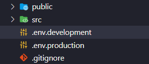
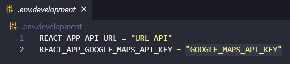
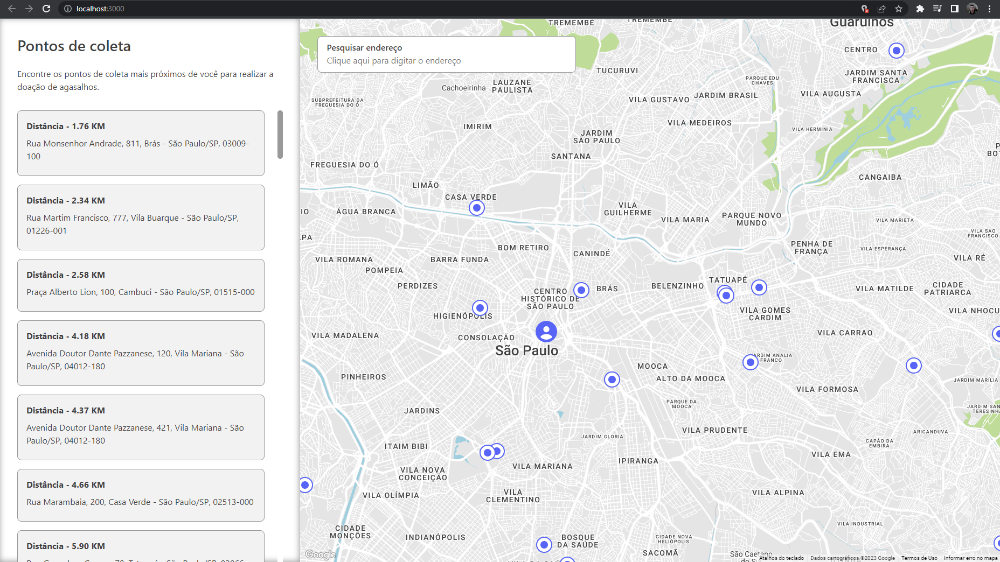

# Website Pontos Coleta Agasalho

Página web que exibe os pontos de coleta de agasalhos para doação em um mapa interativo. Esses pontos de coleta são listados através do consumo da API disponível no sistema [Donations Points Scraping](https://github.com/PedroHPAlmeida/fatec-tg-scraping-donations-points), que recupera essas informações através do processo de **Web Scraping** em outros sites de campanha de agasalhos.

O objetivo desta aplicação é facilitar o acesso dos usuários as informações disponibilizadas pela API através da sua exibição em uma interface de usuário simples e permitir uma melhor navegação ao colocar a marcação desses pontos em um mapa interativo.

## Tecnologias utilizadas

* React, TypeScript, HTML e CSS para desenvolvimento da aplicação;
* API do Google Maps para geração do mapa e implementação do campo de busca com auto complemento;
* Biblioteca Axios para integração com os serviços da API;
* Biblioteca Reactstrap e styled-components para estilização dos componentes e páginas da aplicação;

## Pré-requisitos para executar o projeto

* Node v19.3.0
* Yarn v1.22.19
* React v18.0.0

## Como executar o projeto

1. Clone o repositório:

```
git clone https://github.com/RicardoPauloCunha/website-pontos-coleta-agasalho.git
```

2. Abra o arquivo ```.env.development``` para adicionar as configurações do ambiente de desenvolvimento e o arquivo ```.env.production``` para o ambiente de produção:

<div align="center">



</div>

3. Altere o valor de **URL_API** para o link da API que será utilizada como fonte dos dados;
4. Altere também o valor de **GOOGLE_MAPS_API_KEY** para a sua chave de API do Google Maps (é precisa ativar a API "Maps JavaScript API" e "Places API" para poder utilizar os serviços com essa chave):

<div align="center">



</div>

5. Execute o comando no terminal para instalar os pacotes:

```bash
yarn install
```

6. Em seguida, o comando para executar a aplicação:

```bash
yarn start
```

7. Por fim, abra [http://localhost:3000](http://localhost:3000) para visualizá-lo no navegador.

<div align="center">



</div>